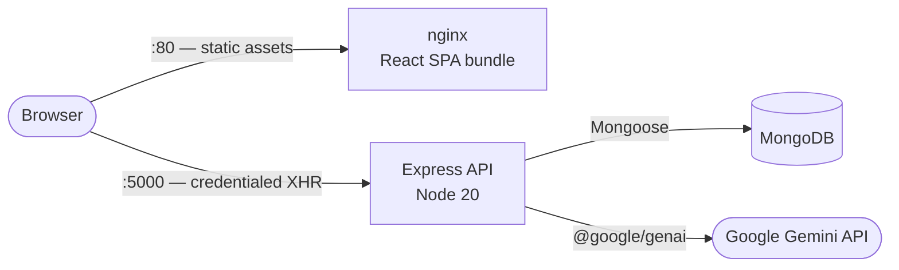

# 🧾 PromptBill — AI-powered Invoice Generator

[](https://github.com/albert4183r7/AI-Invoice-Generator/actions/workflows/ci.yml)
[](LICENSE)
[](https://github.com/albert4183r7/AI-Invoice-Generator/pkgs/container/ai-invoice-generator%2Fbackend)

A full-stack invoicing application where you describe a job in plain English and an LLM turns it
into a structured, exportable invoice. Built on the MERN stack, containerised, and shipped through
an automated pipeline.

---

## Architecture



The frontend is compiled to a static bundle and served by nginx, which also handles SPA routing.
nginx does **not** proxy the API: the browser calls the API directly at the origin compiled into
the bundle as `VITE_API_BASE_URL` (see [Configuration](#configuration)). That keeps the two
containers independent — the SPA image has no knowledge of the API's address beyond a build-time
string, and the API needs no rewriting rules to serve it.

Sessions are stateless. The API issues a signed JWT and the browser returns it in an httpOnly
cookie, so the server holds no session store and any instance can serve any request.

---

## Tech stack

| Layer | Technology |
| --- | --- |
| Frontend | React 19, Vite, Tailwind CSS 4, React Router, Axios |
| Backend | Node.js 20, Express 5, Mongoose |
| Database | MongoDB (Atlas or local) |
| AI | Google Gemini (`gemini-2.5-flash`) via `@google/genai` |
| Testing | Jest + Supertest + `mongodb-memory-server`, Vitest, Cypress |
| Packaging | Docker, Docker Compose |
| CI/CD | GitHub Actions, GitHub Container Registry |

---

## Quickstart

### With Docker Compose

```bash
git clone https://github.com/albert4183r7/AI-Invoice-Generator.git
cd AI-Invoice-Generator

cp backend/.env.example backend/.env   # then fill in MONGO_URI and JWT_SECRET
docker compose up --build
```

| Service | URL |
| --- | --- |
| Frontend | http://localhost |
| API | http://localhost:5000 |
| Grafana | http://localhost:3000 |
| Prometheus | http://localhost:9090 |

Compose brings up the **frontend, the API, Prometheus and Grafana**. The database is expected to
be a MongoDB Atlas cluster (or any reachable MongoDB) referenced by `MONGO_URI` — there is no
database container. Compose will fail to start if `backend/.env` is missing.

To run just the application, without the monitoring stack:

```bash
docker compose up --build backend frontend
```

### Local development

Two terminals, no containers.

```bash
# Terminal 1 — API on :5000
cd backend
npm install
cp .env.example .env      # fill in MONGO_URI and JWT_SECRET
npm run dev
```

```bash
# Terminal 2 — Vite dev server on :5173, with HMR
cd frontend/invoice-generator
npm install
npm run dev
```

---

## Configuration

All backend configuration is via environment variables. See
[`backend/.env.example`](backend/.env.example) for the full list.

| Variable | Required | Purpose |
| --- | --- | --- |
| `MONGO_URI` | yes | MongoDB connection string |
| `JWT_SECRET` | yes | Signs session tokens |
| `GEMINI_API_KEY` | for AI features | Enables the three `/api/ai/*` endpoints; everything else works without it |
| `PORT` | no | API port, defaults to `5000` |
| `CLIENT_URL` | in production | Deployed frontend origin, added to the CORS allowlist |
| `NODE_ENV` | no | `production` enforces the CORS allowlist and switches logs to JSON |
| `LOG_LEVEL` | no | `trace`…`fatal`, defaults to `info` |

`MONGO_URI` and `JWT_SECRET` are validated at startup — a missing one exits immediately rather
than failing on the first request that needs it. `GEMINI_API_KEY` is not validated this way: the
Gemini client is constructed lazily enough that the server boots without it, and only the AI
routes fail, returning `500` with a generic message. That is deliberate — the CRUD and auth
surface should not be taken down by a missing key.

CORS always allows `http://localhost:5173`, `http://localhost:80` and `http://localhost`, so local
development needs no configuration. Outside production, unrecognised origins are permitted too;
in production only `CLIENT_URL` and the three above are accepted. Because the session cookie is
sent with every authenticated request, CORS runs with `credentials: true` and therefore requires
a concrete origin — the wildcard `*` is not usable here.

The frontend reads `VITE_API_BASE_URL`, which is **compiled into the bundle at build time** and
passed as a Docker build argument. Changing it requires rebuilding the frontend image — it is not
read at container start.

---

## API

All invoice and AI routes require a valid session cookie and are scoped to the authenticated user:
requesting another user's invoice returns `404`, the same as requesting one that does not exist.

| Method | Path | Purpose |
| --- | --- | --- |
| `POST` | `/api/auth/register` | Create an account and start a session |
| `POST` | `/api/auth/login` | Start a session |
| `POST` | `/api/auth/logout` | Clear the session cookie |
| `GET` | `/api/auth/me` | Current user profile |
| `PUT` | `/api/auth/me` | Update business details |
| `GET` | `/api/invoices` | List the user's invoices |
| `POST` | `/api/invoices` | Create an invoice |
| `GET` | `/api/invoices/:id` | Fetch one invoice |
| `PUT` | `/api/invoices/:id` | Update an invoice (partial updates accepted) |
| `DELETE` | `/api/invoices/:id` | Delete an invoice |
| `POST` | `/api/ai/parse-text` | Turn a plain-English description into invoice fields |
| `POST` | `/api/ai/generate-reminder` | Draft a payment-reminder email for an invoice |
| `GET` | `/api/ai/dashboard-summary` | Returns `{ insights: [...] }`, or `{ summary: "..." }` when the user has no invoices |

Requests are rate limited to 300 per 15 minutes per client. The health and metrics endpoints are
mounted ahead of the limiter so a frequent probe can never be throttled.

---

## Testing

```bash
# Backend — Jest + Supertest against an in-memory MongoDB (no external DB needed)
cd backend && npm test

# Frontend — Vitest, single pass
cd frontend/invoice-generator && npm run test:unit -- --run

# Frontend — Cypress end-to-end (opens the interactive runner; both servers must be up)
cd frontend/invoice-generator && npm run test:e2e
```

Backend tests exercise the routes through HTTP with a real Express app and a real (ephemeral)
MongoDB instance, rather than mocking Mongoose — including the ownership checks, which are only
meaningful when a second user actually exists to be rejected. See [`backend/tests/`](backend/tests)
and [`frontend/invoice-generator/cypress/e2e/`](frontend/invoice-generator/cypress/e2e) for the
auth and invoice lifecycle flows.

`mongodb-memory-server` downloads a MongoDB binary on first use, so the very first `npm test` run
is slow and needs network access. Subsequent runs reuse the cached binary.

---

## Operations

### Continuous integration

[`.github/workflows/ci.yml`](.github/workflows/ci.yml) runs on every push to `main` or `dev` and
every pull request:

1. **Backend tests** — Jest integration tests against an ephemeral in-memory MongoDB, with the
   MongoDB binary cached across runs keyed on the lockfile.
2. **Frontend lint, unit tests & production build** — ESLint, Vitest, and `vite build`.
3. **Docker image builds** — both images are built with Buildx layer caching to prove the
   `Dockerfile`s still work.

The Docker job is gated on both test jobs, so a broken image or a failing test suite never reaches
a registry. A newer push to the same ref cancels the previous in-flight run.

### Publishing

[`.github/workflows/publish.yml`](.github/workflows/publish.yml) builds and pushes both images to
GitHub Container Registry on every push to `main`, on every `v*` tag, and on manual dispatch:

```
ghcr.io/albert4183r7/ai-invoice-generator/backend:latest
ghcr.io/albert4183r7/ai-invoice-generator/frontend:latest
```

Images are tagged with the branch, the full commit SHA, and semver when tagged, so any running
container can be traced back to an exact commit. Authentication uses the workflow's own ephemeral
`GITHUB_TOKEN` — there are no long-lived registry credentials stored in this repository. The
frontend's `VITE_API_BASE_URL` is read from a repository variable at publish time, falling back to
`http://localhost:5000`.

### Health endpoints

| Endpoint | Question | Behaviour |
| --- | --- | --- |
| `GET /healthz` | Is the process alive? | Always `200`. Does **not** check the database. |
| `GET /readyz` | Should this instance get traffic? | `200` when MongoDB is connected and shutdown has not begun, otherwise `503`. |
| `GET /metrics` | — | Prometheus metrics (RED: rate, errors, duration). |

Liveness deliberately ignores the database: if a dependency blips, failing liveness would restart
every instance at exactly the moment the fleet is least able to absorb the churn. Dependency
health belongs in readiness, where the consequence is leaving rotation rather than being killed.

Both images declare a `HEALTHCHECK`, but they do not probe the same thing. The backend image
probes the API's own `/healthz` on `:5000`. The frontend image probes nginx's `/healthz` on
`:8080`, which nginx answers itself with a static `200` — it reports that the web server is up and
serving, **not** that the API behind it is healthy. Compose uses the backend's healthcheck to gate
the frontend via `depends_on: condition: service_healthy`, and `docker compose ps` reports real
state rather than just "running".

Shutdown is graceful: on `SIGTERM` the process flips readiness to `503`, drains in-flight requests
for up to 15 seconds, closes the database connection, then exits. Compose's `stop_grace_period` is
set above that so Docker does not `SIGKILL` mid-drain.

Prometheus and Grafana are part of `docker compose up`, with the dashboard committed as JSON under
[`monitoring/`](monitoring) and provisioned on startup.

---

## Project layout

```
.
├── .github/workflows/       CI and image-publishing pipelines
├── monitoring/
│   ├── prometheus/          Scrape configuration
│   └── grafana/             Datasource, dashboard provider, dashboard JSON
├── backend/
│   ├── config/db.js         Connection with retry and exponential backoff
│   ├── controllers/         Route handlers (auth, invoices, AI)
│   ├── lib/
│   │   ├── authCookie.js    Session cookie name, options and TTL
│   │   └── lifecycle.js     Shutdown state, shared with the readiness probe
│   ├── middlewares/         Session guard: cookie or bearer token -> req.user
│   ├── models/              Mongoose schemas
│   ├── routes/              Express routers, including /healthz and /readyz
│   ├── tests/               Jest + Supertest integration tests
│   ├── jest.config.js       Test timeout, sized for the first-run MongoDB download
│   ├── logger.js            pino instance with secret redaction
│   ├── metrics.js           prom-client registry and the RED metrics
│   └── Dockerfile           Production image (non-root, healthcheck)
├── frontend/invoice-generator/
│   ├── src/                 React application
│   ├── cypress/e2e/         End-to-end specs
│   ├── nginx.conf           SPA routing, caching, security headers
│   ├── security-headers.conf  Shared add_header snippet
│   └── Dockerfile           Multi-stage build -> unprivileged nginx
└── docker-compose.yml
```

---

<details>
<summary>Development log</summary>

### Week 1: Project Setup & Landing Page
- **Frontend Setup:** Configured React App & Tailwind CSS
- **Structure:** Defined project files, folders, and application routes.
- **Landing Page UI:** Header, Hero, Features, Testimonials, FAQ, and Footer components.

### Week 2: Backend Architecture & API Development
- **Server Initialization:** Backend setup and MongoDB connection.
- **Database Schemas:** Mongoose models for **Users** and **Invoices**.
- **Authentication:** Auth middleware and APIs (login, signup, get profile).
- **Invoice APIs:** CRUD endpoints (create, get all, get by ID, update, delete).
- **AI Backend Logic:** Endpoints for AI invoice creation (text parsing), AI reminder emails, and
  AI dashboard insights.

### Week 3: Client-Side Authentication & Dashboard Core
- **API Integration:** Defined API endpoints and configured the Axios instance.
- **State Management:** Auth context for user session management.
- **Authentication UI:** Login page, signup page, secure dashboard layout.
- **Dashboard Features:** Main dashboard overview and recent invoices section.

### Week 4: Advanced Features, AI UI & Final Polish
- **Smart Analytics:** AI Insights card on the dashboard.
- **Invoice Management:** Create Invoice page with reusable form inputs, All Invoices page with
  filtering, delete and update-status actions.
- **AI Features UI:** "Create with AI" text-to-invoice component, reminder email generator.
- **Final Details:** Invoice detail page with print styling (`window.print()` plus `@media print`
  rules, so the browser's own "Save as PDF" produces the document), profile page for business
  details.

</details>

---

## License

Released under the [MIT License](LICENSE).
