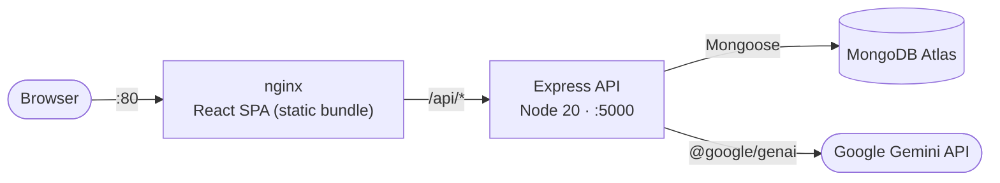

# 🧾 PromptBill — AI-powered Invoice Generator

[](https://github.com/albert4183r7/AI-Invoice-Generator/actions/workflows/ci.yml)
[](LICENSE)
[](https://github.com/albert4183r7/AI-Invoice-Generator/pkgs/container/ai-invoice-generator%2Fbackend)

A full-stack invoicing application where you describe a job in plain English and an LLM turns it
into a structured, exportable invoice. Built on the MERN stack, containerised, and shipped through
an automated pipeline.

Beyond the application itself, this repository is a working demonstration of how I build and run
software: multi-stage container builds, a CI pipeline that gates merges, and images published to a
registry on every release.

---

## Architecture



The frontend is compiled to a static bundle and served by nginx, which also terminates the SPA
routing. The API is stateless apart from its database connection, so it can be scaled horizontally
and replaced on deploy without draining a session store.

---

## Tech stack

| Layer | Technology |
| --- | --- |
| Frontend | React 19, Vite, Tailwind CSS 4, React Router, Axios |
| Backend | Node.js 20, Express 5, Mongoose |
| Database | MongoDB (Atlas or local) |
| AI | Google Gemini via `@google/genai` |
| Testing | Jest + Supertest + `mongodb-memory-server`, Vitest, Cypress |
| Packaging | Docker (multi-stage), Docker Compose |
| CI/CD | GitHub Actions, GitHub Container Registry |

---

## Operations

### Continuous integration

Every push to `main` or `dev`, and every pull request, runs
[`.github/workflows/ci.yml`](.github/workflows/ci.yml):

1. **Backend tests** — Jest integration tests against an ephemeral in-memory MongoDB.
2. **Frontend lint, unit tests & production build** — ESLint, Vitest, and `vite build`.
3. **Docker image builds** — both images are built and layer-cached to prove the
   `Dockerfile`s still work.

The Docker job is gated on both test jobs, so a broken image or a failing test suite
never reaches a registry.

### Publishing

[`.github/workflows/publish.yml`](.github/workflows/publish.yml) builds and pushes both images to
GitHub Container Registry on every push to `main` and on every `v*` tag:

```
ghcr.io/albert4183r7/ai-invoice-generator/backend:latest
ghcr.io/albert4183r7/ai-invoice-generator/frontend:latest
```

Images are tagged with the branch, the full commit SHA, and semver when tagged, so any running
container can be traced back to an exact commit. Authentication uses the workflow's own ephemeral
token — there are no long-lived registry credentials stored in this repository.

### Dependency and image hygiene

[Dependabot](.github/dependabot.yml) opens weekly pull requests for npm dependencies, Docker base
images, and the Actions used by the pipeline itself. Non-major npm updates are grouped so the PR
queue stays readable. Base images are watched separately because OS-level CVEs in `node:20-alpine`
and `nginx:alpine` are invisible to `npm audit`.

### Container builds

Both images are built in stages and contain no source, secrets, or development dependencies:

- The **backend** image installs production dependencies only, then adds the source.
- The **frontend** image compiles the React app in a Node stage and ships only the resulting static
  files behind nginx — no Node runtime and no `node_modules` in the final image.

Both directories carry a `.dockerignore` that excludes `.env` files, `node_modules`, test suites
and build output. `.gitignore` keeps secrets out of the repository; `.dockerignore` keeps them out
of the image, where they would otherwise persist in a layer cache and remain readable via
`docker history` even after deletion. Both containers run as **non-root**: the API as the `node`
user, the frontend as `nginx-unprivileged` (uid 101, listening on 8080).

### Health and lifecycle

The API separates the two questions an orchestrator needs answered:

| Endpoint | Question | Behaviour |
| --- | --- | --- |
| `GET /healthz` | Is the process alive? | Always `200`. Deliberately does **not** check the database. |
| `GET /readyz` | Should this instance get traffic? | `200` when MongoDB is connected and shutdown has not begun, otherwise `503`. |

Keeping liveness independent of the database is deliberate: if a dependency blips, an
instance failing liveness gets *restarted*, and restarting the entire fleet is exactly the
wrong response to a database outage. Readiness is where dependency health belongs, because
the consequence there is being removed from rotation rather than being killed.

Both Dockerfiles carry a `HEALTHCHECK` against the same endpoints, so `docker compose ps`
reports real state rather than just "running" — and Compose will not start the frontend until
the API passes.

**Graceful shutdown.** On `SIGTERM` the API flips readiness to `503` first so a load balancer
stops routing new requests, then drains in-flight requests, then closes the database
connection. A 15s timer forces exit if draining stalls, and `stop_grace_period` in Compose sits
above that so Docker never sends `SIGKILL` mid-drain. Without this, every container restart
drops requests that were already being served.

This is also why both containers invoke their runtime directly rather than through `npm start`:
npm does not reliably forward `SIGTERM` to its child, which would silently defeat the entire
mechanism.

**Database reconnection.** `connectDB` retries with exponential backoff instead of calling
`process.exit(1)` on a failed connection. A database that is briefly unavailable is a
recoverable event, and killing the process would turn a short outage into a crash loop.

### Observability

Structured JSON logging via `pino`, one line per request, each carrying a request id. An inbound
`X-Request-Id` is honoured and echoed back so a request can be followed across services. Secrets
(`authorization`, `cookie`, passwords, `JWT_SECRET`, `GEMINI_API_KEY`, `MONGO_URI`) are redacted
at the logger level — they cannot leak just because they were attached to an object that got
logged.

Metrics are exposed on `GET /metrics` in Prometheus format:

| Metric | Type | Why it matters |
| --- | --- | --- |
| `http_requests_total` | Counter | Rate and error ratio, by method, route and status |
| `http_request_duration_seconds` | Histogram | Latency quantiles; buckets cluster around the latency budget |
| `http_requests_in_flight` | Gauge | Concurrency — rises before latency does when saturating |
| `nodejs_*`, `process_*` | Various | Event loop lag, heap, GC, RSS, from `prom-client` defaults |

Requests are labelled by the **matched route pattern** (`/api/invoices/:id`) rather than the raw
path. Labelling by raw path would give every invoice id its own time series, which is how a
metrics backend gets killed by label cardinality.

Prometheus and Grafana are part of `docker compose up`. The dashboard is committed as JSON under
[`monitoring/`](monitoring) and provisioned automatically on startup — no clicking panels together
in a UI, and the dashboard definition is reviewable in a pull request. Grafana is at
http://localhost:3000, Prometheus at http://localhost:9090.

### Security posture

- `helmet` sets security headers on every API response.
- Rate limiting at 300 requests / 15 min per client. Health and metrics routes are mounted
  **before** the limiter: a probe firing every few seconds must never be throttled, or the rate
  limiter itself becomes the outage.
- CORS is permissive outside production and enforces the `CLIENT_URL` allowlist in production. A
  rejected origin gets `403`, not a `500`.
- nginx adds `X-Content-Type-Options`, `X-Frame-Options` and `Referrer-Policy`, caches
  content-hashed assets immutably, and marks `index.html` `no-cache` so clients cannot pin
  themselves to a stale bundle after a deploy.

---

## Quickstart

### With Docker Compose

```bash
git clone https://github.com/albert4183r7/AI-Invoice-Generator.git
cd AI-Invoice-Generator

cp backend/.env.example backend/.env   # then fill in MONGO_URI, JWT_SECRET, GEMINI_API_KEY
docker compose up --build
```

| Service | URL |
| --- | --- |
| Frontend | http://localhost:80 |
| API | http://localhost:5000 |
| Grafana | http://localhost:3000 |
| Prometheus | http://localhost:9090 |

Compose brings up the **frontend, the API, Prometheus and Grafana**. The database is expected to
be a MongoDB Atlas cluster (or any reachable MongoDB) referenced by `MONGO_URI` in `backend/.env`
— there is no database container. Compose will fail to start if `backend/.env` is missing.

To run just the application, without the monitoring stack:

```bash
docker compose up --build backend frontend
```

### Local development

Two terminals, no containers.

```bash
# Terminal 1 — API on :5000
cd backend
npm install
cp .env.example .env      # fill in MONGO_URI, JWT_SECRET, GEMINI_API_KEY
npm run dev
```

```bash
# Terminal 2 — Vite dev server on :5173, with HMR
cd frontend/invoice-generator
npm install
npm run dev
```

---

## Testing

```bash
# Backend — Jest + Supertest against an in-memory MongoDB (no external DB needed)
cd backend && npm test

# Frontend — Vitest
cd frontend/invoice-generator && npm run test:unit

# Frontend — Cypress end-to-end (requires both servers running)
cd frontend/invoice-generator && npm run test:e2e
```

Backend tests exercise the routes through HTTP with a real Express app and a real (ephemeral)
MongoDB instance, rather than mocking Mongoose. `health.test.js` covers the behaviour an
orchestrator actually depends on: liveness staying `200`, readiness flipping to `503` when the
database is unreachable, and readiness flipping to `503` once shutdown has begun.

See [`backend/tests/`](backend/tests) and
[`frontend/invoice-generator/cypress/e2e/`](frontend/invoice-generator/cypress/e2e) for the auth and
invoice lifecycle flows.

---

## Configuration

All backend configuration is via environment variables. See
[`backend/.env.example`](backend/.env.example) for the full list.

| Variable | Required | Purpose |
| --- | --- | --- |
| `MONGO_URI` | yes | MongoDB connection string |
| `JWT_SECRET` | yes | Signs auth tokens |
| `GEMINI_API_KEY` | yes | Enables the AI invoice and insights endpoints |
| `PORT` | no | API port, defaults to `5000` |
| `CLIENT_URL` | in production | Origin permitted by CORS |
| `NODE_ENV` | no | `production` enforces the CORS allowlist and switches logs to JSON |
| `LOG_LEVEL` | no | `trace`…`fatal`, defaults to `info` |

`MONGO_URI` and `JWT_SECRET` are validated at startup. A missing one is a deploy-time mistake that
no amount of retrying will fix, so the process logs it and exits immediately rather than starting up
and failing on the first request that needs it.

The frontend reads `VITE_API_BASE_URL`, which is **compiled into the bundle at build time** and
passed as a Docker build argument. Changing it requires rebuilding the frontend image — it is not
read at container start.

---

## Project layout

```
.
├── .github/workflows/       CI and image-publishing pipelines
├── monitoring/
│   ├── prometheus/          Scrape configuration
│   └── grafana/             Datasource, dashboard provider, dashboard JSON
├── backend/
│   ├── config/db.js         Connection with retry and exponential backoff
│   ├── controllers/         Route handlers (auth, invoices, AI)
│   ├── lib/lifecycle.js     Shutdown state, shared with the readiness probe
│   ├── middlewares/         JWT auth guard
│   ├── models/              Mongoose schemas
│   ├── routes/              Express routers, including /healthz and /readyz
│   ├── tests/               Jest + Supertest integration tests
│   ├── logger.js            pino instance with secret redaction
│   ├── metrics.js           prom-client registry and the RED metrics
│   └── Dockerfile           Production image (non-root, healthcheck)
├── frontend/invoice-generator/
│   ├── src/                 React application
│   ├── cypress/e2e/         End-to-end specs
│   ├── nginx.conf           SPA routing, caching, security headers
│   ├── security-headers.conf  Shared add_header snippet
│   └── Dockerfile           Multi-stage build -> unprivileged nginx
└── docker-compose.yml
```

---

## Limitations and roadmap

Honest list of what this repository does **not** yet do:

- **No infrastructure as code, and nothing deployed to AWS yet.** This project targets AWS, but
  deployment is still Docker Compose on a local machine: there is no Terraform, no Kubernetes
  manifests, and images are published to GHCR rather than ECR.
- **No alerting.** The metrics and the dashboard exist, but nothing fires when the error rate
  climbs. There is no Alertmanager configuration, and no SLO written down with an error budget
  attached to it — so there is no defined point at which a release should be held back.
- **No runbook or postmortem.** Nothing documents what to do when the API starts returning 5xx,
  which is the artifact that separates "I built monitoring" from "I have been on call".
- **`/metrics` is unauthenticated** and, under Compose, published to the host. In a real deployment
  it belongs on an internal network or behind authentication.
- **No image scanning or SBOM.** Dependabot keeps dependencies current, but nothing blocks a merge
  on a newly disclosed CVE.
- **AI controller errors leak `error.message`** into 500 responses via the `details` field, which
  can expose upstream provider detail to clients.
- **Compose needs an external database.** There is no MongoDB service, so `docker compose up`
  requires a reachable `MONGO_URI` before the API reports ready.

---

<details>
<summary>Development log</summary>

### Week 1: Project Setup & Landing Page
- **Frontend Setup:** Configured React App & Tailwind CSS
- **Structure:** Defined project files, folders, and application routes.
- **Landing Page UI:** Header, Hero, Features, Testimonials, FAQ, and Footer components.

### Week 2: Backend Architecture & API Development
- **Server Initialization:** Backend setup and MongoDB connection.
- **Database Schemas:** Mongoose models for **Users** and **Invoices**.
- **Authentication:** Auth middleware and APIs (login, signup, get profile).
- **Invoice APIs:** CRUD endpoints (create, get all, get by ID, update, delete).
- **AI Backend Logic:** Endpoints for AI invoice creation (text parsing), AI reminder emails, and
  AI dashboard insights.

### Week 3: Client-Side Authentication & Dashboard Core
- **API Integration:** Defined API endpoints and configured the Axios instance.
- **State Management:** Auth context for user session management.
- **Authentication UI:** Login page, signup page, secure dashboard layout.
- **Dashboard Features:** Main dashboard overview and recent invoices section.

### Week 4: Advanced Features, AI UI & Final Polish
- **Smart Analytics:** AI Insights card on the dashboard.
- **Invoice Management:** Create Invoice page with reusable form inputs, All Invoices page with
  filtering, delete and update-status actions.
- **AI Features UI:** "Create with AI" text-to-invoice component, reminder email generator.
- **Final Details:** Invoice detail page, print/download PDF, profile page for business details.

</details>
